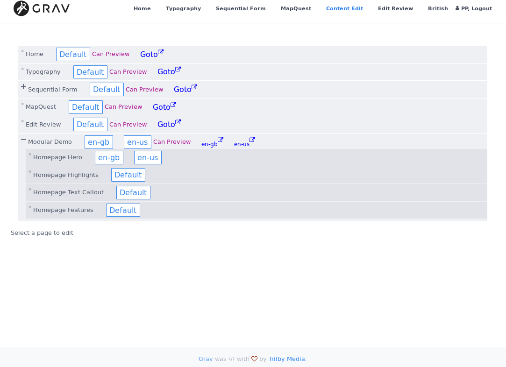
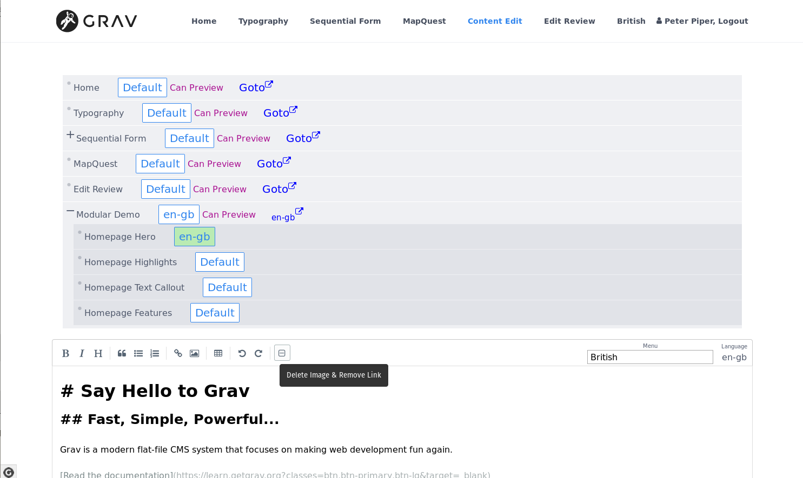

# Content Edit Plugin

Front end editing of the **md** contents (+ `header.menu` ) of web pages by **authorised** users.

The **Content Edit** Plugin is for [Grav CMS](http://github.com/getgrav/grav). The plugin is designed for corporate websites where PR & marketing users want to update the visible parts of a site (the **md** contents and the `page.header.menu`) without needing much technical training (a working knowledge of **md** is required, but is relatively simple). In addition, it is required that the users should NOT have any admin or supervisor permissions on the site. It is required only that they update existing **md** pages. Furthermore, it is required that different users can be given access to different pages. When multiple language files exist in a route, then all are made available for editing independent of the current active language.

## Installation

Installing the Content Edit plugin can be done in one of two ways. The GPM (Grav Package Manager) installation method enables you to quickly and easily install the plugin with a simple terminal command, while the manual method enables you to do so via a zip file.

### GPM Installation (Preferred)

The simplest way to install this plugin is via the [Grav Package Manager (GPM)](http://learn.getgrav.org/advanced/grav-gpm) through your system's terminal (also called the command line).  From the root of your Grav install type:

    bin/gpm install content-edit

This will install the Content Edit plugin into your `/user/plugins` directory within Grav. Its files can be found under `/your/site/grav/user/plugins/content-edit`.

### Manual Installation

To install this plugin, just download the zip version of this repository and unzip it under `/your/site/grav/user/plugins`. Then, rename the folder to `content-edit`. You can find these files on [GitHub](https://github.com/finanalyst/grav-plugin-content-edit) or via [GetGrav.org](http://getgrav.org/downloads/plugins#extras).

You should now have all the plugin files under `/your/site/grav/user/plugins/content-edit`

> NOTE: This plugin is a modular component for Grav which requires [Grav](http://github.com/getgrav/grav) and the [Error](https://github.com/getgrav/grav-plugin-error) and [Problems](https://github.com/getgrav/grav-plugin-problems) to operate, and [Login](https://github.com/getgrav/grav-plugin-login).

> RECOMMENDATION: This plugin has been designed to be used in combination with the Admin and DataManager plugins.

### Admin Plugin

If you use the admin plugin, you can install directly through the admin plugin by browsing the `Plugins` tab and clicking on the `Add` button.

## Configuration

Before configuring this plugin, you should copy the `user/plugins/content-edit/content-edit.yaml` to `user/config/plugins/content-edit.yaml` and only edit that copy.

Here is the default configuration and an explanation of available options:

```yaml
enabled: true
preview: enabled
editReport: html_side_side
```

- `preview` Disable to remove the preview window
- `editReport` selects the renderer for differences between original and edited versions of pages. The four options are generated by the [php-diff library](https://github.com/chrisboulton/php-diff).

All these options can be set in the Admin page.

Note that if you use the admin plugin, a file with your configuration, and named content-edit.yaml will be saved in the `user/config/plugins/` folder once the configuration is saved in the admin.

## Usage

A special page is created to be rendered by the `content-edit` template. Within the header of the page a **page collection** is created. The contents of this collection, or more precisely, the `routes` to files with `.md` content,  is then displayed as a tree.

If there is only **.md** file with no language extension, then with a button for editing labeled 'Default' is shown.

If the route will generate html that can be previewed, then a label is shown, together with an anchor to open the page in another browser tab.

If there are language files with **GRAV** language extensions, then a selector button and anchor (if previewable) are shown for each language.

For example:



The screenshot shows the tree of pages, which pages can be edited, and which can be previewed (generate a valid page). Inclusion, Editing and Previewing can be turned off on a **per route** basis (see [Granular Control](#Granular)).

Here some pages have two language files with extensions `.en-gb.md` and `.en-us.md`.

### Security

Security is handled by the **Login** plugin. The page rendered with the `content-edit` template to provide editing access **SHOULD** be protected by only granting access to users with specific permission. More about permissions can be found in the **Login** documentation.

Allowing for any frontend editing of content creates a vulnerability for hacking. This vulnerability is controlled through the **Login** plugin and setting access permissions on pages that expose content for editing.

A website developer should be aware that since arbitrary JS scripts can be included in **md** content, care must be taken to give editing permission to users.

### Example

For example, we specify one `group` called **editors** and another called **reviewers** by creating `user/config/groups.yaml` with the following content:
```yaml
editors:
      groupname: 'editors'
      readableName: 'PR Staff'
      description: 'For managing corporate site'
      icon: 'pencil'
      access:
          site:
              login: 'true'
              edit: 'true'
reviewers:
    groupname: 'reviewers'
    readableName: 'Oversight staff'
    description: 'review process for corporate site content'
    icon: eye
    access:
        site:
            login: 'true'
            review: 'true'
```
Note that we have not given `reviewers` the `edit` permission.

Next, we create the file `user/pages/site_editing/content-edit.md` (for extra safety, remember that if the directory is not prefixed with a number, as per GRAV defaults, then it will not be visible in the menu, but can be navigated to in the browser URL bar; this means only users who know the route can find it):
```yaml
---
title: Site edit
content:
    items: '@root'
access:
    site: edit
---
```

Now any user that belongs to the `editors` group will be able to access `http://somecorporate.com/site_editing` (assuming the GRAV starts in the www root).

For example, if we create a user called **peter** and under `user/accounts/peter.yaml`:

```yaml
email: peter@somecorporate.com
fullname: PP
title: tester
language: en
groups:
  - editors
hashed_password: qwertyuiop
```

The key item, of course, is groups. By being a member of the `editors` group, the user gets `site.login` and `site.edit` permissions.

## Editor use

The `content-edit` template will generate a page with a tree of pages and subpages, as described above. Each page is normally (see below for granular control) accompanied by an selector button, labeled either `Default` for single language pages, or with the language extension for multi-language pages.

Once an edit button associated with a route is clicked, an instance of simpleMDE (generated by the simplemde Jquery plugin) is opened with the **md**  content, eg.



When the content is edited, a **Save** button appears.

When the header of a page explicitly contains a menu item (in the example the source header contains `menu: 'British'`), the text of the header is provided in a text box that can be edited. *GRAV** provides a number of menu fall backs, but only `menu` can be edited. If there is no `menu` option, then the menu fallback is shown, but cannot be edited.

The language extension for the selected page is also shown with the editor.

In the example, a page is selected which cannot be previewed. When a previewable page is selected, a **Preview** button appears together with the **Save** button. Clicking on the **Preview** button will cause **GRAV** to generate the html for the route. The editor window is swapped for the preview window.

If the Preview option is disabled, the review button will not be visible.

Note that only changes that have been **Saved** will be visible in the **Review** section. Unsaved changes remain in the editor and are not transferred to the website source.

It is possible to link to a file and to insert an image. The file and image are uploaded and a shortcode link is inserted into the **md** code.

A button`minus-square-o` (in the image the cursor is hovering over the button) is provided to remove an image or link.
- To select the file to be deleted:
    1. Select the whole of the link text to be deleted, or
    1. Place the cursor inside the link text.  
    Then click the image delete button.
- The deletion can only be carried out if :
    - the referenced file is in the same directory as the `*.md` file (the developer can place images in other directories, but these are not exposed to a non-admin frontend user),
    - the file can be deleted by the GRAV system (the correct ownership and permissions are set)
    - the referenced file exists.
- If a link is found for which no local file exists, the link text is deleted from the **md** file.

### Page Collections and Different User Groups

All of the files in the `page.collection` will be listed. More about collections can be found in [Grav documentation](https://learn.getgrav.org/content/collections).

If different groups of users are to be given access to different pages, then each page can be assigned some tag appropriate to the user group, and on the content-edit page for that group, the page collection can be created using the appropriate tag.

Currently, there has to be a separate content-edit page for each separate page collection because access is granted on a per page basis, not on a per collection basis.

### Granular Control

Three options are provided on a per route basis. The following may appear in the header of the *default language page*:
```yaml
contentEdit:
    noPreview: true
    noEdit: true
    dontInclude: false
```

Even though it is possible to fine-tune a page collection, there may be pages falling within the collection that should only be edited by a staff member with supervisor permissions.

`dontInclude` can be set to true if a page (and its children) should not be included at all in the route tree.

On each page that should not be edited, the option `contentEdit.noEdit` should be enabled.

When a web page is created dynamically from a number of `*.md` sources, then **GRAV** will probably generate an error if the browser is pointed to a sub-page. This is true for [modular pages](https://learn.getgrav.org/content/modular) and for pages within a [sequential-form](https://github.com/finanalyst/grav-plugin-sequential-form).

The `content-edit` plugin can detected a modular page, but cannot detect other forms of dynamic page. Consequently, the website developer needs to manually label such pages with `contentEdit.noPreview: true` in the page header.

However, each of separate page within a modular page may contain **md** content that should be available for frontend editing. An selector button will be generated for each page in a modular page (provided that `contentEdit.noEdit: true` is not present in that page's header).

## Monitoring Editing
All changes to pages are logged in a diff format in `user/data/content-edit/` in a file that has the month in the filename.

If **Admin Plugin** and [DataManagerPlugin](https://github.com/getgrav/grav-plugin-data-manager) are installed, then `content-edit` provides a template for viewing the editing by someone with `admin` priviledges.

The [php-diff library](https://github.com/chrisboulton/php-diff) provides for two html and two text styles for rendering differences between edited and unedited files. These can be selected in the plugin options.

> Note: the diff rendering is generated at the time edits are saved, not at the time edits are viewed. So if a change is made in diff renderer, old edits will be shown in the previous form.

Here is an example showing edits under each of the four rendering options:


### Frontend Monitoring

Frontend monitoring can be provided by creating a route with a file `content-edit-review.md` in it. (If the route is not prefixed with a digit, then GRAV will not show it in the navigation bar.)

Access to this page can also be controlled using group/users. For example, we create the file `review/content-edit-review.md` with the content:
```
---
title: Edit Review
access:
    site:
        review: true
---
# Editing Applied to Site
```

Note that the access permission is the one granted in the `reviewers` group above. For this example, we gave *peter* `review` permission. The page generates the following


A month can be selected and the edits made in that month are shown. The detail of each edit (if appropriate) can be opened.

## Translations

At present only one language is available. Most of the plugin can be translated, with the exception of text generated by the diff-library.

## Credits

1. GRAV, LOGIN, DataManager developers, of course.
1. Credit is due to [SimpleMDE](https://http://simplemde.com) for its embeddable *md* editor.
1. A great deal of this plugin is inspired by, and chunks just copied from, the  [editable-simplemde](https://github.com/bleutzinn/grav-plugin-editable-simplemde) plugin for GRAV. A very innovative plugin!
1. For the [php-diff library](https://github.com/chrisboulton/php-diff) by Chris Boulton.
1. For the [simple Upload function](http://simpleupload.michaelcbrook.com/) by Michael Brook.

## Known issues

If a plugin other than `content-edit` provides a custom template for DataManager, the one provided by `content-edit` may not be used. In that case, the edits will show up as a standard **yaml** file. This issue does not affect the `content-edit-review` template.

## To Do
- [ ] Provide a mechanism to sanitise tags that could generate active content in an **md** file.
    - This will also require a mechanism to place into the page header such  scripting / shortcode elements that the developer wants on the page.
